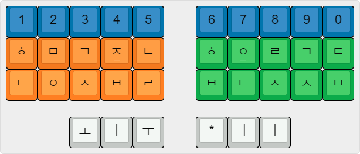
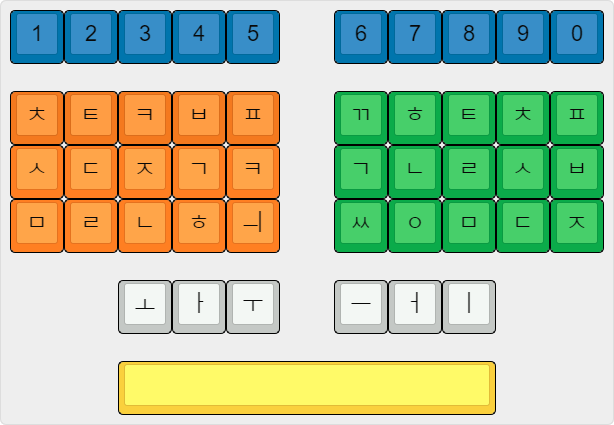

=============
Plover Korean
=============

Korean plugin for `Plover <https://github.com/openstenoproject/plover>`_. This plugin is still under development and breaking changes may happen frequently.

Currently contains:

- System based on the CAS layout with basic functionality.
- System based on the Sorizava layout. Only available when installed from source with setup.cfg modifications for now as I'm not focusing on it.

How to Install
==============

:emphasis:`This plugin has not been released on PyPI yet, so locally installing from source is currently the only option.`

Download the latest version of Plover for your operating system from the `releases page <https://github.com/openstenoproject/plover/releases>`__. Only versions 4.0.0.dev6 and higher are supported.

Once installed, navigate to the Plugin Manager in the main Plover window. From there you should see the "plover-korean" plugin which you can select and install to use after restarting Plover. The same method can be used for updating and uninstalling the plugin.

If you run Plover from source you can alternatively install it directly with pip or you can check out of copy of this repository and install it locally with pip like so::

    pip install -e /path/to/repo

Dictionaries
============

If you need to manually replace or update your dictionaries you can find the released ones `here <https://github.com/nsmarkop/plover_korean/tree/master/plover_korean/dictionaries>`__. Each dictionary is prefixed with the system it applies to.

The released dictionaries are actually compiled versions of several separate dictionaries that are maintained `here <https://github.com/nsmarkop/plover_korean/tree/master/plover_korean/dictionaries_partial>`__ if you want to use those directly.

System Overview - CAS-based Layout
==================================



Syllable Blocks
---------------

Syllable blocks form the foundation of the Korean language and as such the foundation of this system. Excluding the number row, the key layout is divided into three main sections:

- Initial consonant; stroked using the left hand.
- Medial vowel; stroked using the thumbs.
- Final consonant(s); stroked using the right hand.

To understand why this grouping can be used to easily represent every syllable in Korean you should be familiar with Korean syllable block construction which you can read about on `Wikipedia <https://en.wikipedia.org/wiki/Hangul#Morpho-syllabic_blocks>`__.

Consonants
``````````

All base consonants are represented directly on both sides of the key layout; aspirated and tensed variations of them are written using combinations of the base consonants. To make the aspirated version of any consonant you add "ㅎ" to it like so (examples use the initial consonant group steno order for input):

=====  ======
Input  Output
=====  ======
ㅎㅈ    ㅊ
ㅎㄱ    ㅋ
ㅎㄷ    ㅌ
ㅎㅂ    ㅍ
=====  ======

To make the tensed version of any consonant you add "ㅇ" to it like so:

=====  ======
Input  Output
=====  ======
ㅈㅇ    ㅉ
ㄱㅇ    ㄲ 
ㄷㅇ    ㄸ 
ㅇㅂ    ㅃ
ㅇㅅ    ㅆ
=====  ======

You can never have more than one initial consonant thus no conflicts exist in the initial position. For the final consonant position you can have multiple final consonants in the following cases:

- ㄳ
- ㄵ
- ㄶ
- ㄺ
- ㄻ
- ㄼ
- ㄽ
- ㄾ
- ㄿ
- ㅀ
- ㅄ

None of these cases conflict with the use of ㅎ and ㅇ for aspirated and tensed consonants which means both consonant postitions can be fully represented in a safe way.

If the initial consonant is "ㅇ" then it is left out of any strokes. Similarly, if there is no final consonant then nothing is needed in that position.

Vowels
``````

Vowels are either used outright or constructed from their base parts for the complex vowels. The "*" key is used as a modifier when just combining base vowels is not possible for the sound, like the "y" variation of vowels. "ㅖ" is a special case where an easier fingering not requiring pressing three vowel keys with one thumb is chosen over the standard pattern.

All vowels by themselves output their phonetic form so those will be used in the following table for examples:

======  ======
Input   Output
======  ======
ㅗ       오
ㅏ       아
ㅜ       우
-ㅓ      어
-ㅣ      이
ㅏㅓ      으
ㅏㅣ      애
-ㅓㅣ     에
ㅗ*      요
ㅏ*      야
ㅜ*      유
-ㅓ*     여
ㅏ*ㅓ     얘
ㅗㅓㅣ     예
ㅏㅓㅣ     의
ㅗㅣ      외
ㅜㅣ      위
ㅗㅏ      와
ㅜㅓ      워
ㅗㅏㅣ     왜
ㅜㅓㅣ     웨
======  ======

In Practice
```````````

To make syllable blocks you just combine the individual rules for the initial, medial, and final. Some examples:

=============  ======
Input          Output
=============  ======
ㅈㅏ             자
ㅈㅏㅁ            잠
ㅗㅅ             옷
-ㅓㄱ            억
ㅎㄱㅗㅇ           콩
ㄷㅇㅏㅇ           땅
ㅎㅗㅣ/ㅏㅓㅣ        회의
ㅅㅣ/ㄱㅗㅓㅣ        시계
=============  ======

One limitation of the system is that you cannot write consonants or vowels by themselves like "ㅈ" or "ㅏ". Instead you will need to write `letter names <https://en.wikipedia.org/wiki/Hangul#Letter_names>`__ out phonetically like "지읒" via "ㅈㅣ/ㅏㅓㅈ" or "아" via "ㅏ" if the need ever arises. All Korean syllables use at least a consonant and a vowel which is why this is not currently supported.

Spacing
-------

The original CAS machines rely on manual spacing except when otherwise defined in dictionary entries. Plover is different in that by default it attempts to automatically handle spaces between strokes which can cause some issues in Korean due to how spacing works with particle attachment, verb conjugation, etc. when you are inputting things with combinations of briefs and individual syllable blocks.

The current approach to handle this for the system is to use the attach command, "{^}", in most dictionary entries to suppress the spacing. Some alternatives like a dictionary defined stroke for "{MODE:SET_SPACE:}" that would need to be used every time before typing or something on the core Plover side for letting systems define spacing rules are currently being looked into. It is possible that a way to take advantage of Plover's automatic spacing without relying on additional options will be found as well.

Starter Strokes
---------------

A handful of useful strokes to know when getting started are listed below. Using the dictionary lookup in Plover or exploring `the dictionaries in this repository <https://github.com/nsmarkop/plover_korean/tree/master/plover_korean/dictionaries_partial>`__ are otherwise good ways to discover things.

=========  ======
Input      Output
=========  ======
\*         Space
-ㅂㄴ        Undo
-ㅂㄴㅅㅈ      New line
1-ㅇ        Period
1-ㄹ        Comma
1-ㄱ        Question mark
1-ㄷ        Exclamation point
=========  ======

There are patterns to most things in the system, like "1-ㅇ" for a period with a space after it and "1*ㅇ" for a period without a space after it extending to commas and other symbols (other symbols which are stroked by just cycling through left hand number and right hand consonant combinations). I will be formalizing these in the dictionary and documenting them as development progresses.

Briefs
------

The theory for constructing briefs is still being investigated and this will be updated with the patterns as time goes on.

System Overview - Sorizava-based Layout
=======================================


